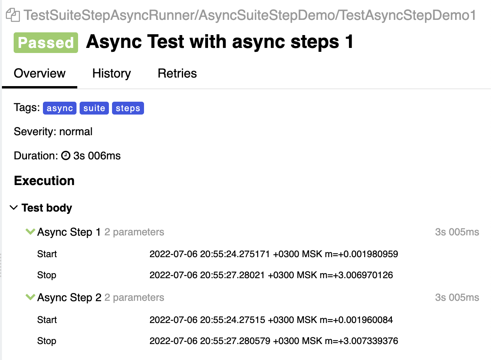
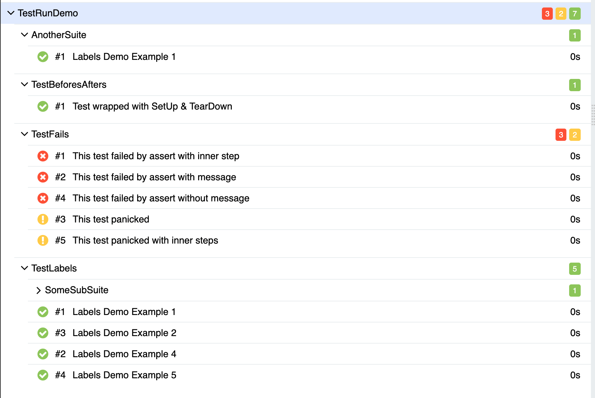

# Allure-Go


Allure-Go - the project that provides a complete allure provider in go, without overloading the interface of usage. <br>
The project started as a fork of testify, but over time it got its own runner and its own features. <br>

## :mortar_board: Head of contents

+ [:mortar_board: Head of contents](#mortar_board-head-of-contents)
+ [:zap: Features](#zap-features)
  + [pkg/allure](#sparkles-pkgallure)
  + [pkg/framework](#sparkles-pkgframework)
+ [:beginner: Getting Started with framework!](#beginner-getting-started-with-framework)
  + [No Suite tests](#no-suite-tests)
  + [Runner](#runner)
  + [Suite](#suite)
+ [:wrench: Configure your environment!](#wrench-configure-your-environment)
+ [:smirk: Going Deeper...](#smirk-going-deeper)
  + [pkg/allure](#pkgallure)
  + [pkg/framework](#pkgframework)
  + [cute](#cute)
+ [:school_satchel: Few more examples](#school_satchel-few-more-examples)
  + [:rocket: Async test](#async-testexamplesasyncasync_step_testgo)
  + [Test with nested steps](#test-with-nested-stepsexamplessuite_demostep_tree_testgo)
  + [Test with attachments](#test-with-attachmentexamplessuite_demoattachments_testgo)
  + [Run few parallel suites](#run-few-parallel-suitesexamplessuite_demorunning_testgo)
  + [Setup hooks](#setup-hooksexamplessuite_demobefores_afters_testgo)
  + [XSkip](#xskipexamplessuite_demofails_testgo)

## :zap: Features

Providing a separate package allows you to customize your work with allure.<br>

### :sparkles: pkg/allure

The package containing the data model for Allure. <br>
Complete list of allure objects:

+ `Attachment`
+ `Container`
+ `Label`
+ `Link`
+ `Parameter`
+ `Result`
+ `Step`

### :sparkles: pkg/framework

The package provides a fully integrated with Allure JUNIT-like framework for working with tests.<br>
Main features:

:white_check_mark:**Allure support**

+ Test plan support (Allure TestOps feature)
+ Tests as code
+ Extensive configuration options for test steps
+ Testify's asserts already wrapped with `allure.Step`!
+ xSkip support (you can mark test as `t.XSkip()` and it will be skipped on fail)

:white_check_mark: **Suite support**

+ Before/After feature
+ Suite as go-struct
+ Suite as sub-test

:white_check_mark: **Parallel running**

+ Parallel tests in suite structs
+ Parallel steps in test functions

## :beginner: Getting Started with framework!

**Step 0.** Install package

```bash
go get github.com/ozontech/allure-go/pkg/framework
```

### No Suite tests

**NOTE:** No suite tests doesn't support before after hooks

**Step 1.** Describe tests

```go
package test

import (
	"testing"

	"github.com/ozontech/allure-go/pkg/framework/provider"
	"github.com/ozontech/allure-go/pkg/framework/runner"
)

func TestRunner(t *testing.T) {
	runner.Run(t, "My first test", func(t provider.T) {
		t.NewStep("My First Step!")
	})
	runner.Run(t, "My second test", func(t provider.T) {
		t.WithNewStep("My Second Step!", func(sCtx provider.StepCtx) {
			sCtx.NewStep("My First SubStep!")
		})
	})
}
```

**Step 2.** Run it!

```bash
go test ./test/... 
```

### Suite

**Step 1.** Make your first test suite

```go
package tests

import (
	"github.com/ozontech/allure-go/pkg/framework/suite"
)

type MyFirstSuite struct {
	suite.Suite
}
```

**Step 2.** Extend it with tests

```go
package tests

import (
	"github.com/ozontech/allure-go/pkg/framework/provider"
	"github.com/ozontech/allure-go/pkg/framework/suite"
)

type MyFirstSuite struct {
	suite.Suite
}

func (s *MyFirstSuite) TestMyFirstTest(t provider.T) {
	t.NewStep("My First Step!")
}

func (s *MyFirstSuite) TestMySecondTest(t provider.T) {
	t.WithNewStep("My Second Step!", func(sCtx provider.StepCtx) {
		sCtx.NewStep("My First SubStep!")
	})
}
```

**Step 3.** Describe suite runner function

```go
package test

import (
	"testing"

	"github.com/ozontech/allure-go/pkg/framework/provider"
	"github.com/ozontech/allure-go/pkg/framework/suite"
)

type MyFirstSuite struct {
	suite.Suite
}

func (s *MyFirstSuite) TestMyFirstTest(t provider.T) {
	t.NewStep("My First Step!")
}

func (s *MyFirstSuite) TestMySecondTest(t provider.T) {
	t.WithNewStep("My Second Step!", func(sCtx provider.StepCtx) {
		sCtx.NewStep("My First SubStep!")
	})
}

func TestSuiteRunner(t *testing.T) {
	suite.RunSuite(t, new(MyFirstSuite))
}
```

**Step 4.** Run it!

```bash
go test ./test/... 
```

### Runner

**Step 1.** Init runner object

```go
package test

import (
	"testing"

	"github.com/ozontech/allure-go/pkg/framework/provider"
	"github.com/ozontech/allure-go/pkg/framework/runner"
)

func TestRunner(t *testing.T) {
	r := runner.NewRunner(t, "My First Suite!")
}
```

**Step 2.** Extend it with tests

```go
package test

import (
	"testing"

	"github.com/ozontech/allure-go/pkg/framework/provider"
	"github.com/ozontech/allure-go/pkg/framework/runner"
)

func TestRunner(t *testing.T) {
	r := runner.NewRunner(t, "My First Suite!")
	r.NewTest("My first test", func(t provider.T) {
		t.NewStep("My First Step!")
	})

	r.NewTest("My second test", func(t provider.T) {
		t.WithNewStep("My Second Step!", func(sCtx provider.StepCtx) {
			sCtx.NewStep("My First SubStep!")
		})
	})
}
```

**Step 3.** Call RunTests function from runner

```go
package test

import (
	"testing"

	"github.com/ozontech/allure-go/pkg/framework/provider"
	"github.com/ozontech/allure-go/pkg/framework/runner"
)

func TestRunner(t *testing.T) {
	r := runner.NewRunner(t, "My First Suite!")
	r.NewTest("My first test", func(t provider.T) {
		t.NewStep("My First Step!")
	})

	r.NewTest("My second test", func(t provider.T) {
		t.WithNewStep("My Second Step!", func(sCtx provider.StepCtx) {
			sCtx.NewStep("My First SubStep!")
		})
	})
	r.RunTests()
}
```

**Step 4.** Run it!

```bash
go test ./test/... 
```

## :wrench: Configure your environment!

### Configure Behavior

The path to allure reports is gathered from the two global variables: `${ALLURE_OUTPUT_FOLDER}/${ALLURE_OUTPUT_PATH}` 

:zap: The `ALLURE_OUTPUT_FOLDER` is the name of the folder where the allure reports will be stored (by
  default, `allure-results`).

---

:zap: The `ALLURE_OUTPUT_PATH` is the path where the `ALLURE_OUTPUT_FOLDER` will be created (by default this is the root
  folder root folder of the test launcher).

---
You can also specify several global configurations to integrate with your TMS or Task Tracker:

:zap: `ALLURE_ISSUE_PATTERN` - Specifies the url pattern for your Issues. Has no default value. **Mandatory**. Must
  contain `%s`.

If `ALLURE_ISSUE_PATTERN` is not specified, the link will be read in its entirety.

Example:

```go
package provider_demo

import (
	"testing"

	"github.com/ozontech/allure-go/pkg/framework/provider"
	"github.com/ozontech/allure-go/pkg/framework/runner"
)

func TestSampleDemo(t *testing.T) {
	runner.Run(t, "Just Link", func(t provider.T) {
		t.SetIssue("https://pkg.go.dev/github.com/stretchr/testify")
	})

	runner.Run(t, "With Pattern", func(t provider.T) {
		_ = os.Setenv("ALLURE_ISSUE_PATTERN", "https://pkg.go.dev/github.com/stretchr/%s")
		t.SetIssue("testify")
	})

}

```
---
:zap: `ALLURE_TESTCASE_PATTERN` - Specifies the url pattern for your TestCases. Has no default value. **Mandatory**. Must
  contain `%s`.

If `ALLURE_TESTCASE_PATTERN` is not specified, the link will be read in its entirety.

Example:

```go
package provider_demo

import (
	"testing"

	"github.com/ozontech/allure-go/pkg/framework/provider"
	"github.com/ozontech/allure-go/pkg/framework/runner"
)

func TestSampleDemo(t *testing.T) {
	runner.Run(t, "Just Link", func(t provider.T) {
		t.SetTestCase("https://pkg.go.dev/github.com/stretchr/testify")
	})

	runner.Run(t, "With Pattern", func(t provider.T) {
		_ = os.Setenv("ALLURE_TESTCASE_PATTERN", "https://pkg.go.dev/github.com/stretchr/%s")
		t.SetTestCase("testify")
	})

}

```
---
:zap: `ALLURE_LAUNCH_TAGS` - Sheds a list of tags that will be applied to each test by default. It has no default value.

:information_source: **Tip:** `ALLURE_LAUNCH_TAGS` - Very handy to use with CI/CD. For example, you can define test groups in it by your
ci-jobs, or you can roll the name of a branch.

---
:zap: `ALLURE_TESTPLAN_PATH` - describes path to your test plan json. 

:information_source: **Tip:** To use this feature you need to work with [Allure TestOps](https://docs.qameta.io/allure-testops/ecosystem/allurectl/#tests-rerun-and-selective-run-with-allurectl)

## :smirk: Going Deeper...

### pkg/allure

:page_facing_up: [pkg/allure documentation](./pkg/allure/README.md)

### pkg/framework

:page_facing_up: [pkg/framework documentation](./pkg/framework/README.md)

### cute

:full_moon_with_face: [You can find cute here!](https://github.com/ozontech/cute)

Cute - is library for simply creating HTTP tests in Go with Allure reports.

Main features:<br>
:zap: Full integration with Allure <br>
:zap: Expressive and intuitive syntax <br>
:zap: Built-in JSON support <br>
:zap: Custom asserts <br>
:zap: One step to BDD <br>

Cute can simply improve your allure-go testing experience! Try it :wink:

## :school_satchel: Few more examples

### [Async test](examples/async/async_step_test.go)

:rocket: **YES!** We really **can** run **parallel** tests in **suites**. <br>
:rocket: Even with async steps. <br>
:rocket: Example below.

Test code:

```go
package async

import (
  "fmt"
  "time"
  
  "github.com/ozontech/allure-go/pkg/framework/provider"
  "github.com/ozontech/allure-go/pkg/framework/suite"
)

type AsyncSuiteStepDemo struct {
  suite.Suite
}

func (s *AsyncSuiteStepDemo) BeforeEach(t provider.T) {
  t.Epic("Async")
  t.Feature("Async Steps")
  t.Tags("async", "suite", "steps")
}

func (s *AsyncSuiteStepDemo) TestAsyncStepDemo1(t provider.T) {
  t.Title("Async Test with async steps 1")

  t.Parallel()

  t.WithNewAsyncStep("Async Step 1", func(ctx provider.StepCtx) {
    ctx.WithNewParameters("Start", fmt.Sprintf("%s", time.Now()))
    time.Sleep(3 * time.Second)
    ctx.WithNewParameters("Stop", fmt.Sprintf("%s", time.Now()))
  })

  t.WithNewAsyncStep("Async Step 2", func(ctx provider.StepCtx) {
    ctx.WithNewParameters("Start", fmt.Sprintf("%s", time.Now()))
    time.Sleep(3 * time.Second)
    ctx.Logf("Step 2 Stopped At: %s", fmt.Sprintf("%s", time.Now()))
    ctx.WithNewParameters("Stop", fmt.Sprintf("%s", time.Now()))
  })
}
```

Allure output:



### [Test with nested steps](examples/suite_demo/step_tree_test.go):

Test code:

```go
package examples

import (
	"github.com/ozontech/allure-go/pkg/framework/provider"
	"github.com/ozontech/allure-go/pkg/framework/suite"
)

type StepTreeDemoSuite struct {
	suite.Suite
}

func (s *StepTreeDemoSuite) TestInnerSteps(t provider.T) {
	t.Epic("Demo")
	t.Feature("Inner Steps")
	t.Title("Simple Nesting")
	t.Description(`
		Step A is parent step for Step B and Step C
		Call order will be saved in allure report
		A -> (B, C)`)

	t.Tags("Steps", "Nesting")

	t.WithNewStep("Step A", func(ctx provider.StepCtx) {
		ctx.NewStep("Step B")
		ctx.NewStep("Step C")
	})
}
```

Output to Allure:


### [Test with Attachment](examples/suite_demo/attachments_test.go)

Test code:

```go
package examples

import (
	"encoding/json"

	"github.com/ozontech/allure-go/pkg/allure"
	"github.com/ozontech/allure-go/pkg/framework/provider"
	"github.com/ozontech/allure-go/pkg/framework/suite"
)

type JSONStruct struct {
	Message string `json:"message"`
}

type AttachmentTestDemoSuite struct {
	suite.Suite
}

func (s *AttachmentTestDemoSuite) TestAttachment(t provider.T) {
	t.Epic("Demo")
	t.Feature("Attachments")
	t.Title("Test Attachments")
	t.Description(`
		Test's test body and all steps inside can contain attachments`)

	t.Tags("Attachments", "BeforeAfter", "Steps")

	attachmentText := `THIS IS A TEXT ATTACHMENT`
	t.Attachment(allure.NewAttachment("Text Attachment if TestAttachment", allure.Text, []byte(attachmentText)))

	step := allure.NewSimpleStep("Step A")
	var ExampleJson = JSONStruct{"this is JSON message"}
	attachmentJSON, _ := json.Marshal(ExampleJson)
	step.Attachment(allure.NewAttachment("Json Attachment for Step A", allure.JSON, attachmentJSON))
	t.Step(step)
}
```

Output to Allure:


### [Run few parallel suites](examples/suite_demo/running_test.go)

Test code:

```go
package examples

import (
	"testing"

	"github.com/ozontech/allure-go/pkg/framework/provider"
	"github.com/ozontech/allure-go/pkg/framework/suite"
)

type TestRunningDemoSuite struct {
	suite.Suite
}

func (s *TestRunningDemoSuite) TestBeforesAfters(t provider.T) {
	t.Parallel()
	// use RunInner to run suite of tests
	s.RunSuite(t, new(BeforeAfterDemoSuite))
}

func (s *TestRunningDemoSuite) TestFails(t provider.T) {
	t.Parallel()
	s.RunSuite(t, new(FailsDemoSuite))
}

func (s *TestRunningDemoSuite) TestLabels(t provider.T) {
	t.Parallel()
	s.RunSuite(t, new(LabelsDemoSuite))
}

func TestRunDemo(t *testing.T) {
	// use RunSuites to run suite of suites
	suite.RunSuite(t, new(TestRunningDemoSuite))
}
```

Output to Allure:



### [Setup hooks](examples/suite_demo/befores_afters_test.go)

Test code:

```go
package examples

import (
	"testing"

	"github.com/ozontech/allure-go/pkg/framework/provider"
	"github.com/ozontech/allure-go/pkg/framework/suite"
)

type BeforeAfterDemoSuite struct {
	suite.Suite
}

func (s *BeforeAfterDemoSuite) BeforeEach(t provider.T) {
	t.NewStep("Before Test Step")
}

func (s *BeforeAfterDemoSuite) AfterEach(t provider.T) {
	t.NewStep("After Test Step")
}

func (s *BeforeAfterDemoSuite) BeforeAll(t provider.T) {
	t.NewStep("Before suite Step")
}

func (s *BeforeAfterDemoSuite) AfterAll(t provider.T) {
	t.NewStep("After suite Step")
}

func (s *BeforeAfterDemoSuite) TestBeforeAfterTest(t provider.T) {
	t.Epic("Demo")
	t.Feature("BeforeAfter")
	t.Title("Test wrapped with SetUp & TearDown")
	t.Description(`
		This test wrapped with SetUp and TearDown containert.`)

	t.Tags("BeforeAfter")
}

func TestBeforesAfters(t *testing.T) {
	t.Parallel()
	suite.RunSuite(t, new(BeforeAfterDemoSuite))
}
```

Output to Allure:


### [XSkip](examples/suite_demo/fails_test.go)

Test code:

```go
package examples

import (
	"testing"

	"github.com/stretchr/testify/require"

	"github.com/ozontech/allure-go/pkg/framework/provider"
	"github.com/ozontech/allure-go/pkg/framework/suite"
)

type DemoSuite struct {
	suite.Suite
}

func (s *DemoSuite) TestXSkipFail(t provider.T) {
	t.Title("This test skipped by assert with message")
	t.Description(`
		This Test will be skipped with assert Error.
		Error text: Assertion Failed`)
	t.Tags("fail", "xskip", "assertions")

	t.XSkip()
	t.Require().Equal(1, 2, "Assertion Failed")
}

func TestDemoSuite(t *testing.T) {
	t.Parallel()
	suite.RunSuite(t, new(DemoSuite))
}
```

Output to Allure:


