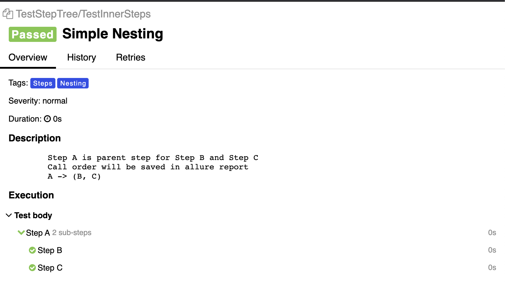
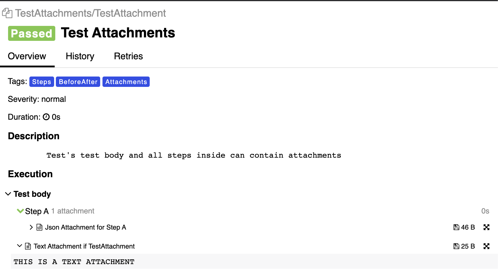
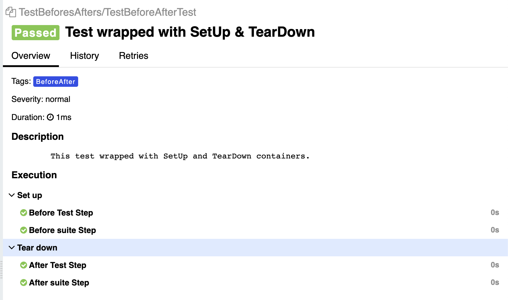

# allure-testify

Allure-Testify is a project that provides a complete allure provider in go, without overloading the interface
usage. <br>
The project started as a fork of testify, but over time it got its own runner and its own features. <br>

## Head of contents

- [Head of contents](#head-of-contents)
- [Features](#features)
- [Getting started](#getting-started)
- [Demo](#demo)
    - [Demo installation](#demo-installation)
    - [Run examples](#run-examples)
- [How to use](#how-to-use)
    - [Installation](#installation)
    - [Configure Behavior](#configure-behavior)
    - [Configure Test](#configure-test)
    - [Configure Suite](#configure-suite)
    - [Configure Your Report](#configure-your-report)
        - [Test Info](#test-info)
        - [Labels](#labels)
        - [Links](#links)
        - [Allure Steps](#allure-steps)
        - [Nested Only Functions](#nested-only-functions)
        - [Allure Attachments](#allure-attachments)
        - [Test Behavior](#test-behaviour)
        - [Forwarded actions to the suite.Suite](#forward-to-suitesuite)
- [Documentation](#documentation)
- [Examples](#examples)
    - [Test with nested steps](#test-with-nested-steps)
    - [Test with attachment](#test-with-attachment)
    - [Run few parallel suites](#run-few-parallel-suites)
    - [Setup hooks](#setup-hooks)
    - [XSkip](#xskip)

## Features

### `pkg/allure

The package containing the data model for Allure. <br>
The complete list of allure objects:

- `Attachment`.
- `Container`
- `Label`.
- `Link`
- `Parameter`
- `Result`
- `Step`.

Providing a separate package allows you to customize your work with allure.<br>
You can read more about it [here](#how-to-use-allure). <br>

### `pkg/provider.T

The test context wrapper (`testing.T`). <br>
Main advantages and features:

- Has its own test runner (`T.Run(testName string, test func(t *provider.T), tags ...string)`), which allows to take
  advantage of the advantages of the `testing` library.
- Functionality analogues in other languages, without loss of convenience and ease of use.
- Fully integrated with `allure`. Your go-tests have never been so informative!

Read more about it [here](#how-to-use-providert). <br>

### `pkg/runner`.

This package provides functions to run test suites and individual tests. <br>
Tests run with these functions will generate an allure report at the end of the execution.<br>
You can read in detail [here](#how-to-use-runner). <br>

### `pkg/suite`.

This package provides a Suite structure in which you can describe tests by grouping them into test suites. This can be
handy if you have a lot of different tests, and it's hard to navigate through them without additional "levels nesting
levels" of test calls. <br>
You can read in detail [here](#how-to-use-suite). <br>

## Getting Started

1. Install package <br>

```bash
go get github.com/koodeex/allure-testify
```

2. If you already use testify, you need to replace the imports

```go
package tests

import (
	"github.com/stretchr/testify/suite"
)
``` 

to

```go
package tests

import (
	"github.com/koodeex/allure-testify/pkg/suite"
)
``` 

3. Replace functions <br>

* `SetupSuite` -> `BeforeAll` <br>
* `SetupTest` -> `BeforeEach` <br>
* `TearDownTest` -> `AfterEach` <br>
* `TearDownSuite` -> `AfterAll` <br>

4. Start the go test!

## Demo

### Demo Installation

```bash
  git clone https://github.com/koodeex/allure-testify.git
```

### Run Examples

```bash
make demo
```

## How to use

### Installation

```bash
go get github.com/koodeex/allure-testify
```

### Configure Behavior

The path to allure reports is gathered from the two global variables `$ALLURE_OUTPUT_FOLDER/$ALLURE_OUTPUT_PATH

- The `ALLURE_OUTPUT_FOLDER` is the name of the folder where the allure reports will be stored (by
  default, `allure-results`).
- The `ALLURE_OUTPUT_PATH` is the path where the `ALLURE_OUTPUT_FOLDER` will be created (by default this is the root
  folder root folder of the test launcher).

You can also specify several global configurations to integrate with your TMS or Task Tracker:

- `ALLURE_ISSUE_PATTERN` - Specifies the url pattern for your Issues. Does not have a default value. **Mandatory**. Must
  contain `%s`.

If `ALLURE_ISSUE_PATTERN` is not specified, the link will be read in its entirety.

Example:

```go
package provider_demo

import (
	"testing"

	"github.com/koodeex/allure-testify/pkg/provider"
	"github.com/koodeex/allure-testify/pkg/runner"
)

func TestSampleDemo(t *testing.T) {
	runner.RunTest(t, "Just Link", func(t *provider.T) {
		t.SetIssue("https://pkg.go.dev/github.com/stretchr/testify")
	})

	runner.RunTest(t, "With Pattern", func(t *provider.T) {
		_ = os.Setenv("ALLURE_ISSUE_PATTERN", "https://pkg.go.dev/github.com/stretchr/%s")
		t.SetIssue("testify")
	})
}
```

- ``ALLURE_TESTCASE_PATTERN`` - Specifies the url pattern for your TestCases. Has no default value. **Mandatory**. Must
  contain `%s`.

If `ALLURE_TESTCASE_PATTERN` is not specified, the link will be read in its entirety.

Example:

```go
package provider_demo

import (
	"testing"

	"github.com/koodeex/allure-testify/pkg/provider"
	"github.com/koodeex/allure-testify/pkg/runner"
)

func TestSampleDemo(t *testing.T) {
	runner.RunTest(t, "Just Link", func(t *provider.T) {
		t.SetTestCase("https://pkg.go.dev/github.com/stretchr/testify")
	})

	runner.RunTest(t, "With Pattern", func(t *provider.T) {
		_ = os.Setenv("ALLURE_TESTCASE_PATTERN", "https://pkg.go.dev/github.com/stretchr/%s")
		t.SetTestCase("testify")
	})
}
```

- ``ALLURE_LAUNCH_TAGS`` - Sheds a list of tags that will be applied to each test by default. It has no default value.

**Tip:** ``ALLURE_LAUNCH_TAGS`` - Very handy to use with CI/CD. For example, you can define test groups in it by your
ci-jobs, or you can roll the name of a branch.

### Configure Test

1) Using the runner package:

```go
package provider_demo

import (
	"testing"

	"github.com/koodeex/allure-testify/pkg/provider"
	"github.com/koodeex/allure-testify/pkg/runner"
)

func TestSampleDemo(t *testing.T) {
	runner.RunTest(t, "My test", func(t *provider.T) {
		// Test Body
	})
}
```

2) Using the context declaration ``TestRunner'':

```go
package provider_demo

import (
	"testing"

	"github.com/koodeex/allure-testify/pkg/runner"
)

func TestOtherSampleDemo(realT *testing.T) {
	r := runner.NewTestRunner(realT)
	r.Run("My test", func(t *provider.T) {
		// Test Body
	})
}
```

The second option will allow the use of BeforeEach/AfterEach:

```go
package provider_demo

import (
	"testing"

	"github.com/koodeex/allure-testify/pkg/runner"
)

func TestOtherSampleDemo(realT *testing.T) {
	r := runner.NewTestRunner(realT)
	r.WithBeforeEach(func(t *provider.T) {
		// Before Each body
	})
	r.WithAfterEach(func(t *provider.T) {
		// After Each body
	})
	r.Run("My test", func(t *provider.T) {
		// Test Body
	})
}
```

A feature of the `testing` library has also been preserved, allowing you to run tests from other tests:

```go
package provider_demo

import (
	"testing"

	"github.com/koodeex/allure-testify/pkg/provider"
	"github.com/koodeex/allure-testify/pkg/runner"
)

func TestOtherSampleDemo(realT *testing.T) {
	r := runner.NewTestRunner(realT)
	r.Run("My test", func(t *provider.T) {
		// Test Body 

		t.WithBeforeTest(func(t *provider.T) {
			// inner Before Each body 
		})
		t.WithAfterTest(func(t *provider.T) {
			// inner After Each body 
		})

		t.Run("My test", func(t *provider.T) {
			// inner test body
		})
	})
}
```

### Configure Suite

To group tests into test suites, you must:

1) declare a structure whose methods will be your tests

```go
package suite_demo

type DemoSuite struct{}
```

2) Extend the declared structure with the `suite.Suite` structure

```go
package suite_demo

import "github.com/koodeex/allure-testify/pkg/suite"

type DemoSuite struct{ suite.Suite }
```

3) Describe tests

```go
 package suite_demo

import "github.com/koodeex/allure-testify/pkg/suite"

type DemoSuite struct{ suite.Suite }

func (s *DemoSuite) TestSkip() {
	s.Epic("Demo")
	s.Feature("Suites")
	s.Title("My first test")
	s.Description(`. This test will be attached to the suite DemoSuite`)
}
```

4) Run the tests.

To do this, you need to describe a function that will run your test and call ``runner.RunSuite``:

```go
 package suite_demo

import (
	"testing"

	"github.com/koodeex/allure-testify/pkg/runner"
	"github.com/koodeex/allure-testify/pkg/suite"
)

type DemoSuite struct {
	suite.Suite
}

func (s *DemoSuite) TestSkip() {
	s.Epic("Demo")
	s.Feature("Suites")
	s.Title("My first test")
	s.Description(`. This test will be attached to the suite DemoSuite`)
}

func TestSkipDemo(t *testing.T) {
	t.Parallel()
	runner.RunSuite(t, new(SkipDemoSuite))
}
```

And run tests with ``go test``

```bash
 go test ${TEST_PATH}
```

Then in the root folder of the tests, at the end of the run, the folder `allure-results` will be initialized, containing
allure-reports.

### Configure Your Report

Allure-Testify provides a wide range of options for interacting with allure.<br>
Most of the actions are done with the help of the `provider.T` structure, which is a wrapper over `testing.T`.<br>
Also the `uite.Suite` structure allows you to use the Suite interface to interact with allure-report.

#### Test Info

A full list of supported methods for putting info about the method:

- `*T.Title`.
- `*T.Description`.

**Note:** By default the test name is set to the name of the test function.

#### Labels

Full list of supported labels:

- `*T.Epic`.
- `*T.Feature`.
- `*T.Story`.
- `*T.ID`
- `*T.Severity`
- `*T.ParentSuite`
- `*T.Suite`
- `*T.SubSuite`
- `*T.Package`
- `*T.Thread`
- `*T.Host`
- `*T.Tag`
- `*T.Framework`
- `*T.Language`
- `*T.Owner`
- `*T.Lead`.

Read more about methods [here] (DOCUMENTATION.md#allurelabel)

##### Default label values

| Label | Default Value |
|---|---|
|`ParentSuite`| - For suite.Suite the name of the function in which the suite was run.<br><br> - For independent tests - not set by default, but if the test was called inside another test, this label will indicate the test that ran the parent for the current test.|
|`Suite`|- For suite.Suite the name of the suite to which the current test belongs is put. <br><br> - For independent test - the name of the parent test (from which the current test was run).|
|`Package`|Package in which the tests were run|
|`Thread`|The `Result.FullName` [[1]](#label_note_answer1).|
|`Host`|`os.Host()||
|`Framework`|`Allure-Testify@v0.3.x`|
|`Language`||runtime.Version()`|

___________________________________  
***NOTES:***
<a name="label_note_answer1">[1]</a> - This is a Knowing Issue - in golang it doesn't seem appropriate (or possible yet
by adequate means) to try to get the name of the current goroutine, nor is it possible to give it a name.
___________________________________

#### Links

Full list of supported actions:

- `*T.SetIssue`.
- `*T.SetTestCase`.
- `*T.Link`.

You can read more about methods [here] (DOCUMENTATION.md#allurelink).

About the variables you can interact with to simplify the work was mentioned [above](#configure-behavior).

#### Allure Steps

Full list of supported actions:

- `*T.Step` - adds the passed Step to the report.
- `*T.NewStep` - creates a new empty Step with the passed name and adds it to the report.
- `*T.InnerStep` - adds a passed Step to the report, setting the passed ParentStep as parent.
- `*T.NewInnerStep` - creates a new empty Step with the passed name and adds it to the report, puts the passed parent
  ParentStep as a parent and adds it to the report.
- `*T.WithStep` - wraps the function passed to f with the passed Step and adds Step to the report.
- `*T.WithNewStep` - creates a new Step, wraps the passed in f function with the created Step and adds it to the report.

#### Nested-Only Functions

- `*T.AddAttachmentToNested` - adds Attachment to a nested step
- `*T.AddParameterToNested` - adds Parameter to the nested step
- `*T.AddParametersToNested` - adds all elements of the Parameter array to the nested step
- `*T.AddNewParameterToNested` - initializes a new Parameter and adds it to the nested step
- `*T.AddNewParametersToNested` - initializes a new Parameter array and adds all its elements to the nested step

**Note:** Functions with the suffix `ToNested` can be called **THERE** within the `WithStep`/`WithNewStep`` function. В
Otherwise nothing will happen.

#### Allure Attachments

Full list of supported actions:

- `*T.Attachment` - adds an Attachment to the current test

#### Test Behaviour

Full list of supported actions:

- `*T.Skip` - skips the current test. The report status will include the passed text.
- `*T.Errorf` - marks the selected test as Failed. The transferred text will be attached to the report status,
- `*T.XSkip` - skips the selected test if `*T.Error` / `*T.Errorf` is called during its execution (e.g, assert fails)

#### Forward to suite.Suite

Full list of supported actions:

- [Test Info](#test-info)
    - `*Suite.Title`.
    - `*Suite.Description`.
- [Allure Labels](#labels)
    - `*Suite.Epic`
    - `*Suite.Feature`
    - `*Suite.Story`
    - `*Suite.ID`
    - `*Suite.Severity`
    - `*Suite.ParentSuite`
    - `*Suite.Suite`
    - `*Suite.SubSuite`
    - `*Suite.Package`
    - `*Suite.Thread`
    - `*Suite.Host`
    - `*Suite.Tag`
    - `*Suite.Framework`
    - `*Suite.Language`
    - `*Suite.Owner`
    - `*Suite.Lead`
- [Allure Links](#links)
    - `*Suite.SetIssue`
    - `*Suite.SetTestCase`
    - `*Suite.Link`
- [Allure Steps](#allure-steps)
    - `*Suite.Step`
    - `*Suite.NewStep`
    - `*Suite.InnerStep`
    - `*Suite.InnerNewStep`
    - `*Suite.WithStep`
    - `*Suite.WithNewStep`
- [Nested Only Functions](#nested-only-functions)
    - `*Suite.AddNestedAttachment`
    - `*Suite.AddParameterToNested`
    - `*Suite.AddParametersToNested`
    - `*Suite.AddNewParameterToNested`
    - `*Suite.AddNewParametersToNested`
- [Allure Attachments](#allure-attachments)
    - `*Suite.Attachment`

## Documentation

Detailed documentation for each public package can be found in that package's directory.

- [allure](/pkg/allure/README.md)
- [provider](/pkg/provider/README.md)
- [runner](/pkg/framework/runner/README.md)
- [suite](/pkg/framework/suite/README.md)

## Examples

### [Test with nested steps](examples/suite_demo/step_tree_test.go):

Test code:

```go
package examples

import (
	"github.com/koodeex/allure-testify/pkg/suite"
)

type StepTreeDemoSuite struct {
	suite.Suite
}

func (s *StepTreeDemoSuite) TestInnerSteps() {
	s.Epic("Demo")
	s.Feature("Inner Steps")
	s.Title("Simple Nesting")
	s.Description(`
		Step A is parent step for Step B and Step C
		Call order will be saved in allure report
		A -> (B, C)`)

	s.Tags("Steps", "Nesting")

	s.WithNewStep("Step A", func() {
		s.NewStep("Step B")
		s.NewStep("Step C")
	})
}
```

Output to Allure:



### [Test with Attachment](examples/suite_demo/attachments_test.go)

Test code:

```go
package examples

import (
	"encoding/json"

	"github.com/koodeex/allure-testify/pkg/allure"
	"github.com/koodeex/allure-testify/pkg/suite"
)

type JSONStruct struct {
	Message string `json:"message"`
}

type AttachmentTestDemoSuite struct {
	suite.Suite
}

func (s *AttachmentTestDemoSuite) TestAttachment() {
	s.Epic("Demo")
	s.Feature("Attachments")
	s.Title("Test Attachments")
	s.Description(`
		Test's test body and all steps inside can contain attachments`)

	s.Tags("Attachments", "BeforeAfter", "Steps")

	attachmentText := `THIS IS A TEXT ATTACHMENT`
	s.Attachment(allure.NewAttachment("Text Attachment if TestAttachment", allure.Text, []byte(attachmentText)))

	step := allure.NewSimpleStep("Step A")
	var ExampleJson = JSONStruct{"this is JSON message"}
	attachmentJSON, _ := json.Marshal(ExampleJson)
	step.Attachment(allure.NewAttachment("Json Attachment for Step A", allure.JSON, attachmentJSON))
	s.Step(step)
}
```

Output to Allure:



### [Run few parallel suites](examples/suite_demo/running_test.go)

Test code:

```go
package examples

import (
	"testing"

	"github.com/koodeex/allure-testify/pkg/suite"
)

type TestRunningDemoSuite struct {
	suite.Suite
}

func (s *TestRunningDemoSuite) TestBeforesAfters() {
	t := s.T()
	t.Parallel()
	// use RunInner to run suite of tests
	s.RunSuite(t, new(BeforeAfterDemoSuite))
}

func (s *TestRunningDemoSuite) TestFails() {
	t := s.T()
	t.Parallel()
	s.RunSuite(t, new(FailsDemoSuite))
}

func (s *TestRunningDemoSuite) TestLabels() {
	t := s.T()
	t.Parallel()
	s.RunSuite(t, new(LabelsDemoSuite))
}

func TestRunDemo(t *testing.T) {
	// use RunSuites to run suite of suites
	suite.RunSuite(t, new(TestRunningDemoSuite))
}
```

Output to Allure:


### [Setup hooks](examples/suite_demo/befores_afters_test.go)

Test code:

```go
package examples

import (
	"testing"

	"github.com/koodeex/allure-testify/pkg/suite"
)

type BeforeAfterDemoSuite struct {
	suite.Suite
}

func (s *BeforeAfterDemoSuite) BeforeEach() {
	s.NewStep("Before Test Step")
}

func (s *BeforeAfterDemoSuite) AfterEach() {
	s.NewStep("After Test Step")
}

func (s *BeforeAfterDemoSuite) BeforeAll() {
	s.NewStep("Before suite Step")
}

func (s *BeforeAfterDemoSuite) AfterAll() {
	s.NewStep("After suite Step")
}

func (s *BeforeAfterDemoSuite) TestBeforeAfterTest() {
	s.Epic("Demo")
	s.Feature("BeforeAfter")
	s.Title("Test wrapped with SetUp & TearDown")
	s.Description(`
		This test wrapped with SetUp and TearDown containers.`)

	s.Tags("BeforeAfter")
}

func TestBeforesAfters(t *testing.T) {
	t.Parallel()
	suite.RunSuite(t, new(BeforeAfterDemoSuite))
}
```

Output to Allure:



### [XSkip](examples/suite_demo/fails_test.go)

Test code:

```go
package examples

import (
	"testing"

	"github.com/stretchr/testify/require"

	"github.com/koodeex/allure-testify/pkg/suite"
)

type DemoSuite struct {
	suite.Suite
}

func (s *DemoSuite) TestXSkipFail() {
	s.Title("This test skipped by assert with message")
	s.Description(`
		This Test will be skipped with assert Error.
		Error text: Assertion Failed`)
	s.Tags("fail", "xskip", "assertions")

	t := s.T()
	t.XSkip()
	require.Equal(t, 1, 2, "Assertion Failed")
}

func TestDemoSuite(t *testing.T) {
	t.Parallel()
	suite.RunSuite(t, new(DemoSuite))
}
```

Output to Allure:


